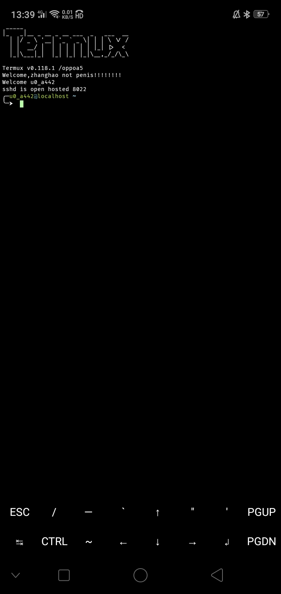

Termux 基础
=================
本页面更新于 2024/10/20，将博客文章上的内容移植了过来，同时补充了部分内容。
  
基本操作是得学的，大大增加效率

界面
==============
下图界面不会长的和你刚安装的时候一模一样，因为改了配置

很简单，上面是终端，显示输出和输入，下面是一些快捷按键。

缩放文本
-------------------
双指放大/缩小用于调整文本大小

菜单项
-------------------
目前菜单项如下

.. code-block::

    菜单项
    ├── COPY:    # 复制
    ├── PASTE:   # 粘贴
    ├── More:    # 更多
       ├── Select URL:       # 提取屏幕所有网址
       └── Share transcipt:    # 分享命令脚本
       └── Reset:             # 重置
       └── Kill process:      # 杀掉当前会话进程
       └── Style:             # 风格配色 需要自行安装
       └── Keep screen on:    # 保持屏幕常亮
       └── Help:              # 帮助文档
       └── Settings:              # Termux 设置
       └── Report Issue:   # 提交 Issue（转至termux仓库的issue页面）

会话
------------
从屏幕最左边往右滑动可打开会话管理，你可以在此新建会话 ``NEW SESSION`` 、切换会话、重命名会话和启动软键盘 ``KEYBOARD``

你也可以在你的通知栏查看termux目前运行的会话数量（前提是为termux授予通知权限）

常用按键
---------------
在linux及大多数pc上，常用的ESC、Tab、CTRL等，这些常用按键在安卓下是无法使用的。但termux给了我们一个可以使用它们的机会，使得日后使用更加方便。
  
打开或隐藏常用按键有如下方法：

方法1
~~~~~~~~~~~~
从屏幕最左边往右滑动打开会话管理，长按左下方的 ``KEYBOARD`` 按钮

方法2
~~~~~~~~~~~~
使用快捷键：``音量+`` + ``Q`` 或者``音量+`` + ``K``

快捷键
-----------------
在终端上，``CTRL`` 是终端用户常用的按键
 
在termux中，开发团队将 ``CTRL`` 键设置在了 ``音量减小按钮`` 以此模拟 ``CTRL``

以下是快捷键表：

.. list-table::
    :header-rows: 1
    
    * - 快捷键
      - 对应按键
    * - ``Ctrl+A``
      - 将光标移到行首
    * - ``Ctrl+C``
      - 终止进程
    * - ``Ctrl+D``
      - 注销当前会话
    * - ``Ctrl+E``
      - 将光标移到行尾
    * - ``Ctrl+K``
      - 将光标删除到行尾
    * - ``Ctrl+U``
      - 将光标删除到行首
    * - ``Ctrl+L``
      - 清除终端文本
    * - ``Ctrl+Z``
      - 挂起当前进程
    * - ``Ctrl+ALT+C``
      - 创建新会话

创建新会话的快捷键需要黑客键盘应用，本应用的链接请移到 Termux 插件与应用 页面  
由于上述已经标明了 ``音量-`` 模拟 ``CTRL`` ，如果需要清楚当前文本（ ``CTRL+L`` ）则按下``音量-`` + ``L`` 即可实现清屏。其他也是如此

当然，``音量+`` 也可以产生特定输入的 ``特殊键``

.. code-block::

    音量加 + E -> Esc键
    音量加 + T -> Tab键
    音量加 + 1 -> F1（音量增加 + 2 → F2…以此类推）
    音量加 + 0 -> F10
    音量加 + B -> Alt + B，使用readline时返回一个单词
    音量加 + F -> Alt + F，使用readline时转发一个单词
    音量加 + X -> Alt+X
    音量加 + W -> 向上箭头键
    音量加 + A -> 向左箭头键
    音量加 + S -> 向下箭头键
    音量加 + D -> 向右箭头键
    音量加 + L -> | （管道字符）
    音量加 + H -> 〜（波浪号字符）
    音量加 + U -> _ (下划线字符)
    音量加 + P -> 上一页
    音量加 + N -> 下一页
    音量加 + . -> Ctrl + \（SIGQUIT）
    音量加 + V -> 显示音量控制
    音量加 + Q -> 切换显示的功能键视
    音量加 + K -> 切换显示的功能键视图

参考
---------------
`Termux 高级终端安装使用配置教程 | 国光 <https://www.sqlsec.com/2018/05/termux.html>`_
