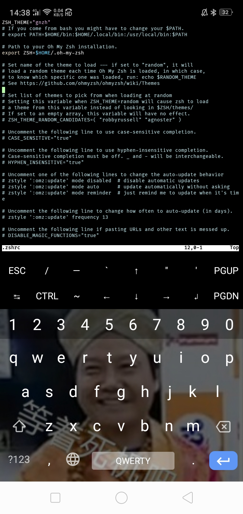

# oh-my-zsh in termux
本页面更新于 2024/10/20，部分内容移动于博客文章做了部分修改  
给你的终端美化一波，包靓的孩子
## 安装
**脚本项目地址：**[https://github.com/Cabbagec/termux-ohmyzsh/](https://github.com/Cabbagec/termux-ohmyzsh/) 
脚本使用了`zsh`替换原`bash`作为默认shell，支持替换字体、主题和添加插件
```bash
sh -c "$(curl -fsSL https://github.com/Cabbagec/termux-ohmyzsh/raw/master/install.sh)"
```
`port 443: Connection refused`情况下，请使用用国光迁移到国内的脚本地址：
```bash
sh -c "$(curl -fsSL https://html.sqlsec.com/termux-install.sh)"
```
执行脚本中间会弹出配置设置：
```bash
Enter a number, leave blank to not to change: 17
Enter a number, leave blank to not to change: 6
```
这两个分别是`终端色彩配置`和`字体样式配置`，在你输入完成这两个鬼东西之后，termux将关闭  
再次进入termux将生效  

## 配置
### 配置方案
运行`chcolor`重新设置色彩方案  
运行`chfont`重新设置字体
### 配置文件
zsh 的主题存放于 `$HOME/.zshrc` 下，可以通过各种编辑器文件打开它。
```bash
vim ~/.zshrc
```

具体的参数这里只列如下两个常用的参数：
| 参数 | 含义 |
| --- | --- |
| ZSH\_THEME | zsh 的主题文件，输入时不带后缀。所有主题文件可查看目录 `~/.oh-my-zsh/themes`  |
| plugins | zsh 的插件应用列表，将插件名放进此处便可使用该插件。所有插件名应用一个英文括号括住，且括号里的两个插件名中间要空一个空格（例如在等号后面可以这样填：`(git zsh-autosuggestions)`。你也可以将该实例复制到你的参数了，但必须要先提前安装插件`git clone https://github.com/zsh-users/zsh-autosuggestions $ZSH_CUSTOM/plugins/zsh-autosuggestions`） |
## 插件
zsh 的插件也是其中的灵魂之一
#### zsh-users/zsh-autosuggestions
这个插件将根据你的使用习惯去补全代码提高效率
```bash
# 以下为安装命令
git clone https://github.com/zsh-users/zsh-autosuggestions $ZSH_CUSTOM/plugins/zsh-autosuggestions
vim ~/.zshrc
# 以下为 ~/.zshrc 配置
# 找到下方行
plugins=(git)
# 改成这样
plugins=(<其他插件名> zsh-autosuggestions)
# 例如
plugins=(git zsh-autosuggestions)
```
然后输入`:wq`退出即可  
接下来可以尝试补全命令了，输入你之前输入过的命令，会出现补全提示  
这时只需要按下`右方向键`或快捷键`音量加+D`即可补全
### oh-my-zsh
安装了 oh-my-zsh 的，可以使用
```bash
vim ~/.zshrc
```
在最后添加你想要的自启动命令。也是自启动，该文件里的命令会在 oh-my-zsh 启动前执行
## 参考
[Termux 高级终端安装使用配置教程 | 国光](https://www.sqlsec.com/2018/05/termux.html)
