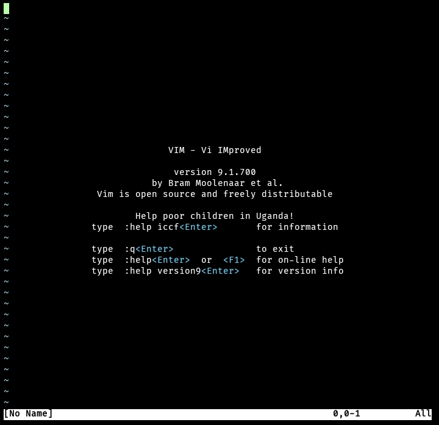

# vim in termux
更新于 2024/10/20
## Vim 介绍
一个老牌的上古真神 ，从 vi 发展出来的一个文本编辑器，但却有代码高亮、代码补充和编译等各种编程使用的东西，被广泛运用在各种各样的程序上，也注定了他就是一个代码编辑器的程序。也算是个老牌真神了吧。  
如果你有需要在`termux`上做程序代码的必要，`vim`可以作为你的第一首选！

## 安装
在 Termux 终端中输入：
```bash
pkg install vim
```
便可完成安装
## 命令格式
正常情况下，输入`vim`可启动正常的Vim界面：

如果要打开文件，输入`vim <文件名>`可打开该文件
## 学习使用 vim
vim 共分为三种模式，**命令模式（Command Mode）、输入模式（Insert Mode）和可视化模式（Visual Mode）**
### 命令模式
用户刚进入编辑时便进入到了命令模式。在命令模式下，用户按下键盘上任意按键动作都会被vim识别为命令。例如按下`i`键就会进入到输入模式。  
以下为命令模式下的一些常用命令：
- `i` 切换到输入模式
- `:` 切换到底线命令模式
- `v` 切换到可视模式
- `u` 撤销操作
- `音量加+r` 重做上一次撤销的操作
- `dd` 剪切当前行
- `yy` 复制当前行
- `p (小写)` 粘贴剪贴版内容到光标上方
- `P (大写)` 粘贴剪贴版内容到光标上方
- `/<文本>` 查找\<文本\>文字，输入完后按下回车进入查找模式。查找模式下`n`为查找上一个，`N(大写)`为查找下一个。`ESC`退出查找模式
- `:w` 保存文件
- `:wq` 保存并退出
- `:q!` 不保存并退出
若想要编辑文本，只需要启动 Vim，进入了命令模式，按下`i`切换到输入模式即可。
命令模式只有一些最基本的命令，因此仍要依靠**底线命令行模式**输入更多命令。
### 输入模式
在命令模式下按下 i 就进入了输入模式，在输入模式中，可以使用以下按键：
- `字符按键以及Shift组合` 输入字符
- `ENTER` 换行
- `BACK SPACE` 删除光标前一个字符
- `DEL` 删除光标后一个字符
- `方向键` 在文本中移动光标
- `HOME/END` 移动光标到行首/行尾
- `Page Up/Page Down` 上/下翻页
- `Insert` 切换光标为输入/替换模式，光标将变成竖线/下划线
- `ESC` 退出输入模式并切换到命令模式
#### 底线命令模式
在命令模式下按下 :（英文冒号）就进入了底线命令模式。
在底线命令模式中，常用的命令有：
- `:w` 保存文件
- `:q`：退出编辑器
- `:wq` 保存文件并退出
- `:q!` 强制退出不保存修改
按 ESC 键可随时退出底线命令模式
### 可视化模式
在可视化模式下，可以对一个文本块的整体进行操作。可视化模式的好处在于，不但可以大大提高操作的效率，而且还可以在做改动之前，就看到操作将影响的文本。  
在命令模式中使用命令v进入可视化模式。在此模式下，用命令移动光标，光标起始位置和当前位置之间的文本将会以高亮显示。这时就可以对这些高亮显示的文本进行整体的操作。

选中文本后，可执行如下操作：
- `d` 删除选中文本
- `y` 复制高亮文本
- `p` 将选中的文本替换成剪贴板的内容
- `ESC键` 退出
### 工作模式图
一目了然（本工作图取自菜鸟教程，但是所示的版本过老了，没提到可视模式）

## 实例
先执行命令，\<文件名\>的内容可以随便写一个文件名
```bash
vim <文件名>
```
然后进入到vim，是命令模式。这时候你可以通过上方的步骤去进行一些操作，例如输入`i`进入输入模式来写文字。 
写完了之后，按下`ESC`回到命令模式，并输入`:wq`保存并退出，该文件就保存好了
## 参考
[Linux vi/vim - 菜鸟教程](https://www.runoob.com/linux/linux-vim.html)  
[VIM学习笔记 可视化模式 (Visual Mode) - 知乎](https://zhuanlan.zhihu.com/p/58513837)